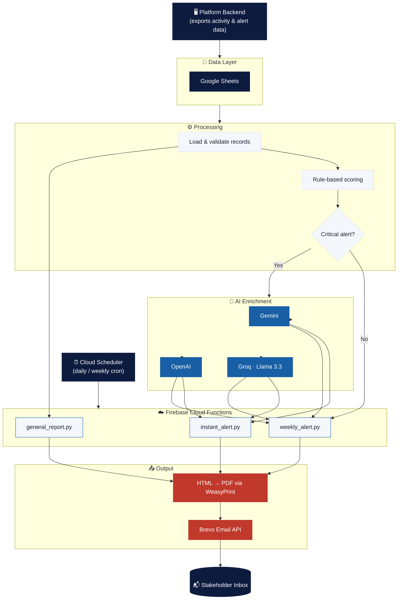
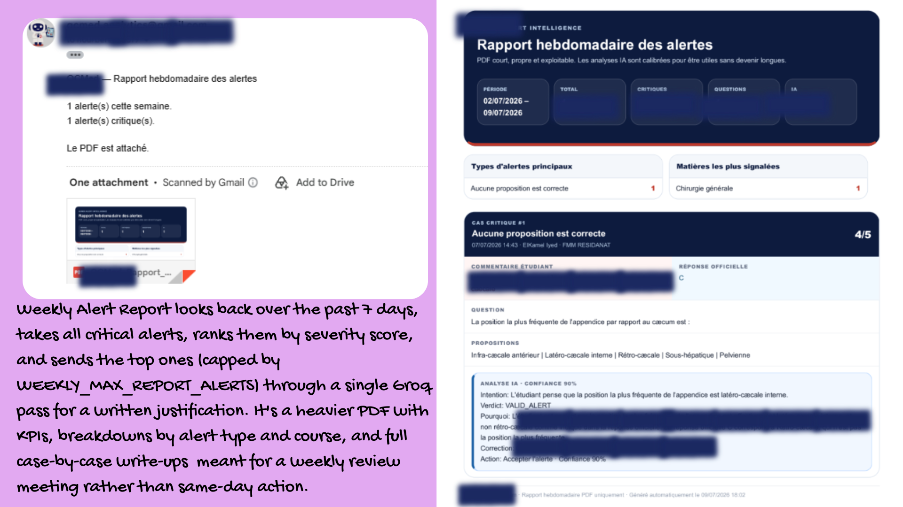
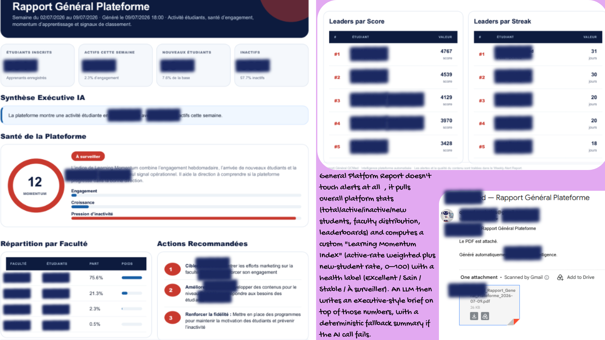
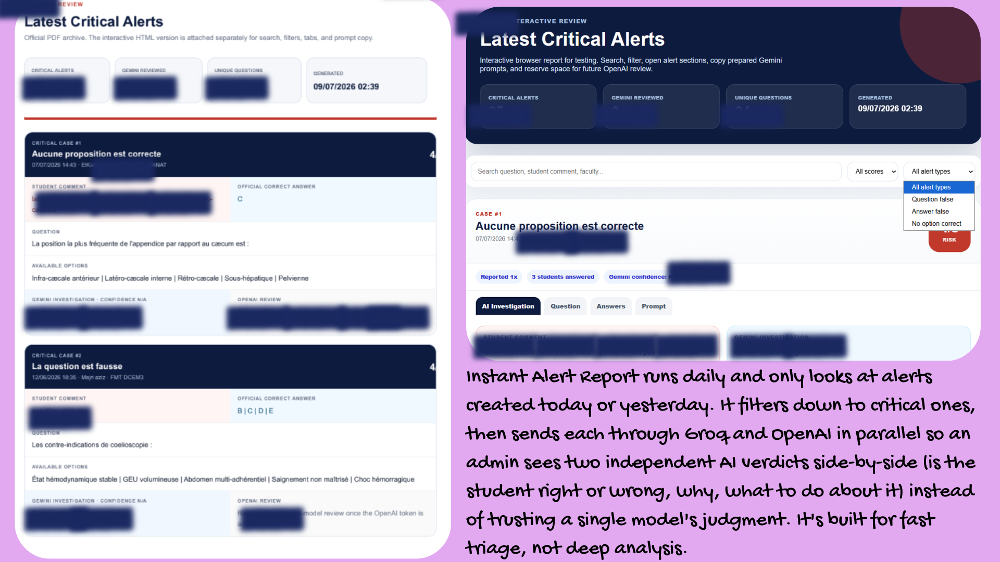

<div align="center">

# 🩺 User Behavior Analysis System

### Automated Analytics & Alert Intelligence Pipeline

<a href="#"></a>

<br/>


</div>

---

## 🔒 A note before you scroll

> This repository is a **portfolio copy** of an internal analytics system I built during a backend/data internship.
> The **company name, real user data, and any identifying information have been redacted or anonymized**. Screenshots below have sensitive numbers (student counts, names, emails) **blurred**. Any brand names left inside the code/templates (colors, PDF headers, etc.) are internal placeholders and do **not** represent the actual client.
>
> **Why this repo has a single commit:** this is a **snapshot copy-paste** of the original codebase, published here purely to showcase the work. The real project lives in a **private company repository** with a full commit history built over time across **multiple contributors** on the team. This copy intentionally does not reflect that history.

---

## 📖 Overview

This system sits at the intersection of **EdTech** and **AI in medical education** — it automates **behavioral analytics and quality-alert reporting** for a medical e-learning platform (quiz/course based, used by medical students preparing exams). It reads raw activity & alert data from a data source (Google Sheets, fed by the platform's backend), runs it through a **rule-based + LLM classification pipeline** to catch flawed exam questions and content-quality issues, and produces polished **PDF reports** that are emailed automatically to stakeholders — no manual work required.

Three independent scheduled jobs cover three different reporting needs:

| Job | Frequency | Purpose |
|---|---|---|
| ⚡ **Instant Alert Report** | Daily / on-demand | Surfaces **critical, unresolved alerts** from today & yesterday, cross-checked by multiple LLM providers for a fast triage view |
| 📅 **Weekly Alert Report** | Weekly | Deep-dive PDF on the week's critical alerts, with AI-written justifications, KPIs, and breakdowns by type/course |
| 📊 **General Platform Report** | Weekly | Executive-style **platform health report**: engagement, growth, faculty distribution, leaderboards, and an AI-generated executive brief with recommended actions |

---

## ✨ Key Features

- 🧠 **Hybrid classification engine** — deterministic rule scoring first, then selective LLM enrichment only on the alerts that actually need deeper judgment (cost-efficient)
- 🤝 **Multi-provider AI cross-validation** — Gemini, Groq (Llama), and OpenAI are used side-by-side on instant alerts to reduce single-model bias
- 🖨️ **Dynamic PDF generation** — HTML/CSS reports rendered to PDF with WeasyPrint, styled like real executive dashboards (KPI cards, mini bar charts, leaderboards, ranked case studies)
- 📧 **Automated transactional email delivery** — reports + attachments sent via the Brevo (Sendinblue) API
- 🕰️ **Timezone-safe scheduling logic** — all "this week" / "today or yesterday" windows are computed in local time before comparison
- 🧩 **Clean modular architecture** — shared `types`, `services` (sheets, classifier, email) reused across all three jobs
- 🛡️ **Fail-soft design** — malformed rows are skipped and logged instead of crashing the pipeline; AI failures gracefully fall back to a deterministic French-language summary

---

## 🔄 Project Evolution

This system went through a few real iterations rather than being built once and left alone:

- **Data source:** originally pulled data directly from the platform's **admin dashboard**. This was later migrated to a **Google Sheets export** fed by the backend instead, since it decoupled the reporting pipeline from the dashboard's internal API and made the data layer easier to read, validate, and swap out.
- **Email delivery:** went through three providers before settling. Started with plain **SMTP**, moved to **AWS SES** for better deliverability and scale, and finally switched to the **Brevo (Sendinblue) API** for its simpler transactional API, attachment handling, and reliability for this volume of email. Config for all three stages is still visible in `config.py`, kept as a trace of that evolution.
- **Deployment:** moved from manual deploys to a **CI/CD pipeline** (GitHub Actions) that pushes each function to Firebase automatically on merge, removing manual `firebase deploy` steps and reducing deployment drift between jobs.

---

## 🏗️ Architecture



---

## 🛠️ Tech Stack

<div align="center">


</div>

<div align="center">

| Layer | Technology |
|---|---|
| **Language** | Python 3.11+ |
| **Data Source** | Google Sheets API (`gspread` + Service Account) |
| **AI / LLM Providers** | Google Gemini, Groq (Llama 3.3), OpenAI |
| **PDF Rendering** | WeasyPrint (HTML/CSS → PDF) |
| **Email Delivery** | Brevo (Sendinblue) Transactional Email API |
| **Scheduling** | Cron / scheduled cloud job (daily & weekly triggers) |
| **Deployment** | Firebase Cloud Functions (Python runtime), triggered on a schedule via Google Cloud Scheduler |
| **CI/CD** | GitHub Actions — automated deploy to Firebase on merge |
| **Secrets Management** | Google Cloud Secret Manager (production) / `python-dotenv` (local dev) |
| **Data Modeling** | Python `dataclasses` (typed `SheetAlert`, `User`, `LeaderboardEntry`...) |

</div>

---

## 📂 Project Structure

```
user-behavior-analysis-system/
├── functions/
│   ├── jobs/
│   │   ├── general_report.py      # Weekly executive platform report
│   │   ├── instant_alert.py       # Daily critical-alert triage report
│   │   └── weekly_alert.py        # Weekly deep-dive alert report
│   ├── services/
│   │   ├── classifier.py          # Rule engine + multi-LLM enrichment
│   │   ├── email.py                # Brevo email delivery
│   │   └── sheets.py               # Google Sheets data access layer
│   └── shared/
│       └── types.py                # Typed dataclasses (Alert, User, etc.)
├── src/shared/
│   └── config.py                   # Environment-based configuration
├── test_brevo.py                   # Manual email delivery smoke test
├── requirements.txt
└── README.md
```

---

## 📸 Screenshots

> All figures below (student counts, names, emails, scores) are **blurred** to protect real user data.

<div align="center">

<!-- 🖼️ Screenshot 1 -->


<br/><br/>

<!-- 🖼️ Screenshot 2 -->


<br/><br/>

<!-- 🖼️ Screenshot 3 -->


</div>

---

## ⚙️ Environment Variables

> These are used for **local development only**. In production, the equivalent secrets are stored in **Google Cloud Secret Manager** and injected into each Cloud Function at runtime — no real values are shown here, only the variable names your local `.env` needs.

```env
# Google Sheets
SERVICE_ACCOUNT_FILE=
SHEET_ID=
SHEET_TAB=

# AI Providers
GEMINI_API_KEY=
GEMINI_MODEL=
GROQ_API_KEY=
GROQ_MODEL=
INSTANT_GROQ_API_KEY=
INSTANT_OPENAI_API_KEY=
INSTANT_OPENAI_MODEL=
WEEKLY_GROQ_API_KEY=
GENERAL_GROQ_API_KEY=
AI_TIMEOUT_SECONDS=

# Email (Brevo)
BREVO_API_KEY=
BREVO_SENDER_EMAIL=
BREVO_SENDER_NAME=
RECIPIENT_EMAIL=

# Report Tuning
WEEKLY_MAX_LLM_ALERTS=
WEEKLY_MAX_REPORT_ALERTS=
```

---

## ☁️ Deployment

Each of the three jobs is deployed as an independent **Firebase Cloud Function** (Python runtime), not a long-running server. This keeps the system serverless and cost-efficient — nothing runs (or costs anything) outside of its scheduled window.

- **Trigger:** Google **Cloud Scheduler** fires each function on its own cron schedule — daily for the instant alert report, weekly for the weekly alert and general platform reports.
- **Isolation:** each job is a self-contained entry point that pulls what it needs from the shared `services/` and `shared/` modules, so one job failing (e.g. an LLM timeout) can't take down the others.
- **Config & secrets:** in production, API keys and credentials are **not** stored in `.env` files — they're pulled from **Google Cloud Secret Manager** at runtime and injected into each function. `.env` is only used for local development; nothing sensitive is ever committed or hardcoded.
- **Observability:** each run prints a structured summary (alert counts, critical counts) to Cloud Functions logs, so failures and drift are visible without opening the PDF.

---

## 🚀 Running Locally

```bash
# 1. Clone & enter the project
git clone <this-repo>
cd user-behavior-analysis-system

# 2. Create a virtual environment
python -m venv venv
source venv/bin/activate   # Windows: venv\Scripts\activate

# 3. Install dependencies
pip install -r requirements.txt

# 4. Configure environment variables
cp .env.example .env   # then fill in your own values

# 5. Run any of the three jobs
python -m functions.jobs.instant_alert
python -m functions.jobs.weekly_alert
python -m functions.jobs.general_report
```

---

## 🎓 What I Learned

- Designing a **cost-aware AI pipeline**: only escalating to LLMs when a deterministic rule engine flags something as worth reviewing
- Building **production-style HTML → PDF reports** with real design systems (color tokens, spacing scale, componentized cards)
- Handling **multi-provider LLM orchestration** with graceful fallbacks when an API fails or times out
- Structuring a small Python codebase with **clear service boundaries** (`sheets`, `classifier`, `email`) that stay reusable across multiple jobs
- Thinking about **data confidentiality** end-to-end, from raw data handling to what ends up in a portfolio repo

---

<div align="center">

*Built as part of a data/backend internship — shared here with all company & user identifiers removed.*

</div>
